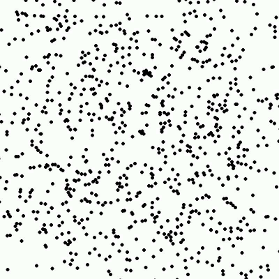
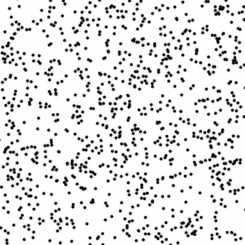
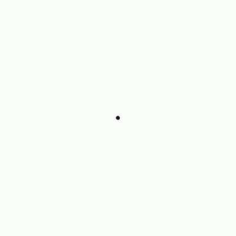
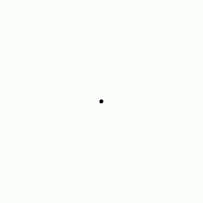
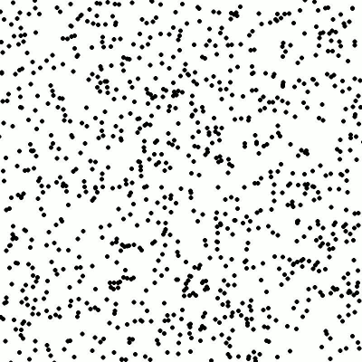
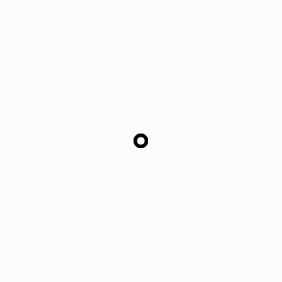
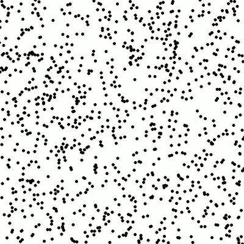

# Universe Particle Simulation

This is a particle simulation project based on the [work](https://www.youtube.com/watch?v=makaJpLvbow) of Thomas Schmickl and Martin Stefanec of University of Graz, Austria. It simulates the movement of particles in a universe and visualizes the results using Matplotlib.

---

## Installation
This project uses Poetry to manage dependencies. If you don't have Poetry installed, you can use pip for installation.

### Method 1: Using poetry:
If you have Poetry installed, you can install the project dependencies by running the following command in the project directory:

```bash
poetry shell
poetry install
```

This will create a virtual environment and install all the required packages.

### Method 2: Using pip:
If you don't have Poetry installed, you can use pip to install the dependencies. Run the following command in the project directory:

```bash
pip install -r requirements.txt
```

---

## Usage
To run the simulation, you can use the following command:
```bash
python main.py
```
This will start the simulation and display the results using Matplotlib.

One can experiment with the simulation by changing the initial conditions in the `main.py` file. The initial conditions are defined in the `initial_conditions.py` file.

---
## Examples
Some interesting initial conditions have been provided in the `interesting_conds.py` file, which can be called by:
```bash
python interesting_conds.py <initial_condition_name>
```
<!-- Table of two columns with gifs and captions -->
| Initial Condition Name | GIF |
| :--: | :--: |
| **`galaxy`** |  |
| **`onion`** |  |
| **`stable_ring_collapse`** |  |
| **`shedding_ring`** |  |
| **`petri_dish`** |  |
| **`pulse_ring`** |  |
| **`swarm`** |  |


---

## License
This project is licensed under the MIT License - see the LICENSE file for details.